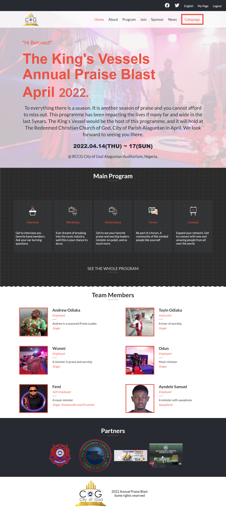

# RCCG COG Praise Blast Annual Programme
# Build a website for a Conference, concert or online tutoring programme capstone project

## Description
> A Website for RCCG COG Annual Praise Blast Programme.

## Built With

- HTML
- CSS
- JS

## Live Demo
* [Demo](https://aeon9300.github.io/Praise-Blast/)

## Procedure to clone project
- open your terminal
- type git clone https://github.com/aeon9300/Praise-Blast.git
- run the project in your local machine
- Run the project in you browser 
- Inspect it to check the look in mobile format.

## Author

👤 *Adebisi Ayodele Samuel*

- GitHub: [@githubhandle](https://github.com/aeon9300)
- Twitter: [@twitterhandle](https://twitter.com/aeon9300)
- LinkedIn: [LinkedIn](https://www.linkedin.com/in/samuel-adebisi-4a589362/)

## 🤝 Contributing

Contributions, issues, and feature requests are welcome!

Feel free to check the [issues page](../../issues/).

## Show your support

Give a ⭐ if you like this project!

## Acknowledgments
* Template design by [Cindy Shin](https://www.behance.net/adagio07)
* Hat tip to anyone whose code was used
* Inspiration
* RCCG King's Vessels images